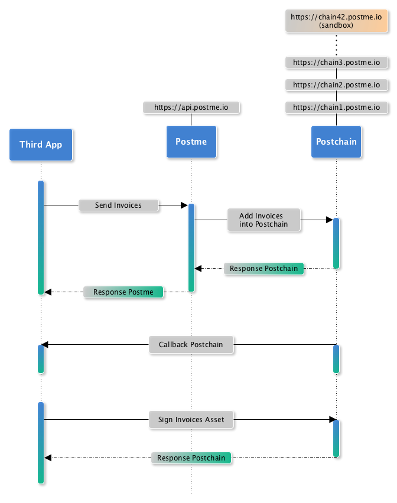

.. _getting-started:

Getting started
===============

Prerequisites
-------------

Create a developer account
~~~~~~~~~~~~~~~~~~~~~~~~~~

First thing you need to do is creating a developer account.

* Go to https://app.postme.io
* Click on "Create a developer account"
* Activate your email adress

Register your application
~~~~~~~~~~~~~~~~~~~~~~~~~

* From the dashboard, go to "My apps"
* Click on "New App"
* Enter a title for your app (i.e. "My invoicing system")
* Save

Generate your application credentials
~~~~~~~~~~~~~~~~~~~~~~~~~~~~~~~~~~~~~

Once your application is created, you can generate App ID/key pairs to get API access.

* Click on "Generate New Key"
* Enter a name for the new generated key (i.e. "Test")
* If you want to use these credentials for test purpose, check "Sandbox Mode"

Using Postme API
----------------

Authentication
~~~~~~~~~~~~~~

.. http:post:: /api/login

   **Example request**:

   .. sourcecode:: http

      POST /api/login HTTP/1.1
      Host: example.com
      Accept: application/json

   **Example response**:

   .. sourcecode:: http

      HTTP/1.1 200
      Vary: Accept
      Content-Type: application/json

   :jsonparam `string` app_id: your APP_ID
   :jsonparam `string` app_secret: your APP_SECRET
   :reqheader Accept: ``application/json``
   :resheader Content-Type: ``application/json``
   :statuscode 200: Authentication succeeded
   :statuscode 401: Unauthorized

Using Postchain
---------------

Create a new private/public keys
~~~~~~~~~~~~~~~~~~~~~~~~~~~~~~~~

Behaviour
~~~~~~~~~

